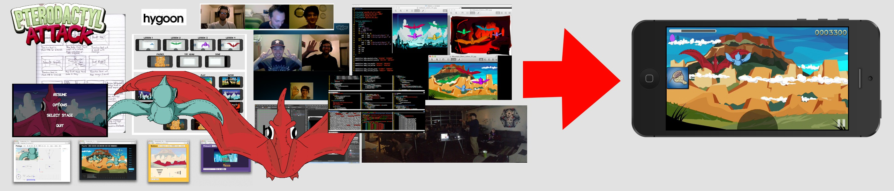

How we made a game
==================

We spent a long time making the game [Pterodactyl
Attack](http://youtu.be/uDx9aQIYfP8?t=30s) from scratch with no experience.

__Pterodactyl Attack__ is an indie game coming to App Store and Google Play.
It was developed in plain javascript and HTML5 canvas.  Its source code will be
made free and open source some time after its release.

You can consider the following articles a formal walkthrough of our development
process.  You can read our free-form [devblog here](http://hygoon.com/blog).

- [X] [Quick Look](quick-look.md)
- [X] [Operations](devops.md)
- [X] [File Overview](files.md)
- [X] [Flow](flow.md)
- [X] [Drawing to the Screen](drawing.md)
- [X] [Pterodactyl Paths](paths.md)
- [X] [Textures (Vectors & Bitmaps)](textures.md)
- [X] [Environment Backgrounds](env.md)
- [X] [Menu and HUD layouts](layouts.md)
- [X] [Aiming Mechanic](aiming.md)
- [X] [Gameplay Design](gameplay.md)
- [X] [The tutorial](tutorial.md)
- [X] [The surprise](surprise.md)
- [ ] Stress and its impacts
