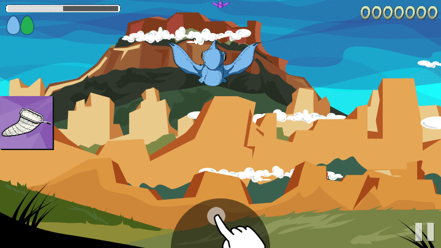
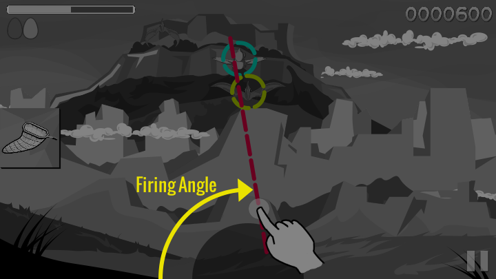
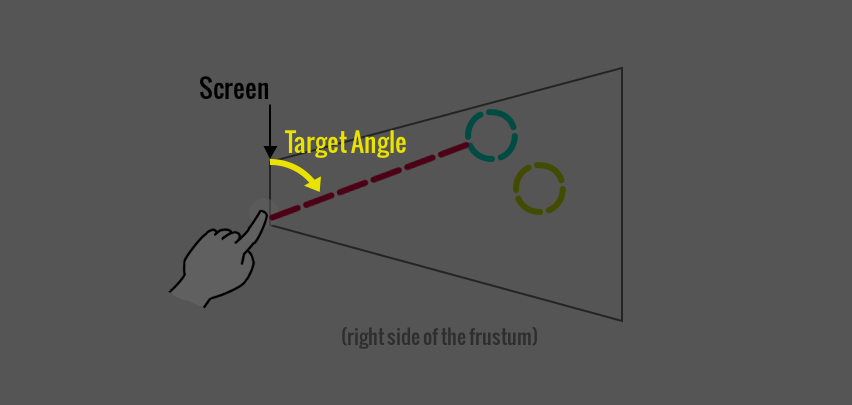
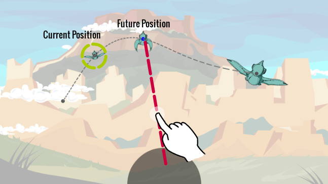
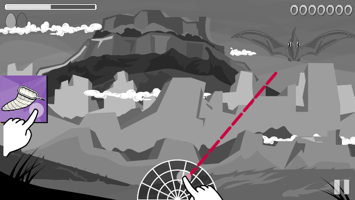

# Aiming Mechanic

Shooting pterodactyls in the game requires a simple swiping motion.  Though the
motion is simple, its implementation is not so straightforward.  So we will
talk about how it is implemented.

## The motion

To shoot the pterodactyls, you cannot simply tap on them.  In fact, if you do
try tapping on them, this animation will attempt to correct you:

You must "throw" bullets from the orb with a swiping motion.  That is, you
touch the orb at the bottom of the screen, then swipe toward the pterodactyl
you are attempting to hit.

## Priority Targeting

What if you are trying to shoot a pterodactyl that is at the same firing angle
as another?  The firing priority of the orb is to shoot the one closest to you.
The closest ones, the orb presumes, are probably the most threatening and
should be shot first.

## Auto-aim

The orb uses a rather heavy auto-aim mechanism to make sure your bullet lands
right where you probably intended it to go.  This is necessary since swiping
only has one degree of freedom, whereas aiming at objects in space requires two
degrees of freedom.

We call these degrees of freedom the firing angle and the target angle.

### Firing Angle

The first degree of freedom is the "firing angle" which is directly determined
by the swiping motion, shown below:

This angle narrows down our firing range to a "slice" of space (i.e. anything behind
the line shown above).

### Target Angle

The second degree of freedom is the "target angle" which controls the "pitch"
of the projectile.  This is computed automatically by choosing the closest pterodactyl
behind the firing line.

## Target-leading

The orb doesn't fire directly at targets.  It leads the targets by reading the
future trajectory of each pterodactyl and trying to lead your bullet to the
earliest point of impact possible.

So if you see a pterodactyl flying horizontally, you must try to lead your shot
to account for the time it will take your bullet to reach it.  The orb aiming
allows this.

## The Net

The orb actually fires two types of projectiles: a bullet or a net.  The bullet
is the default projectile.  To active the net projectiles, you must hold the
net button down.

So the net requires two fingers: one to hold the net button, and the other to
fire the net from the orb.
