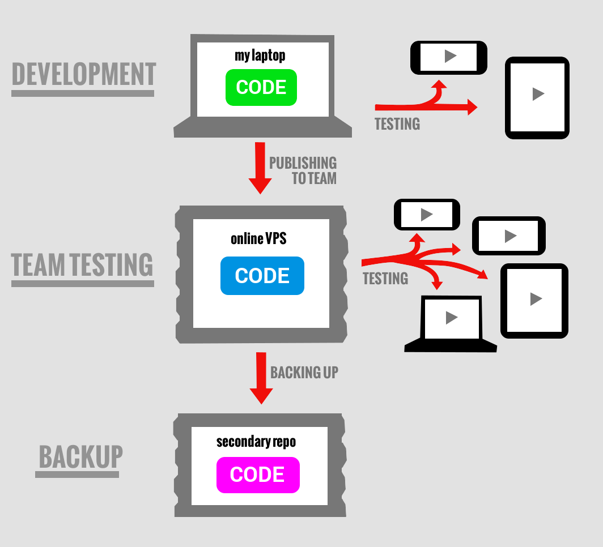
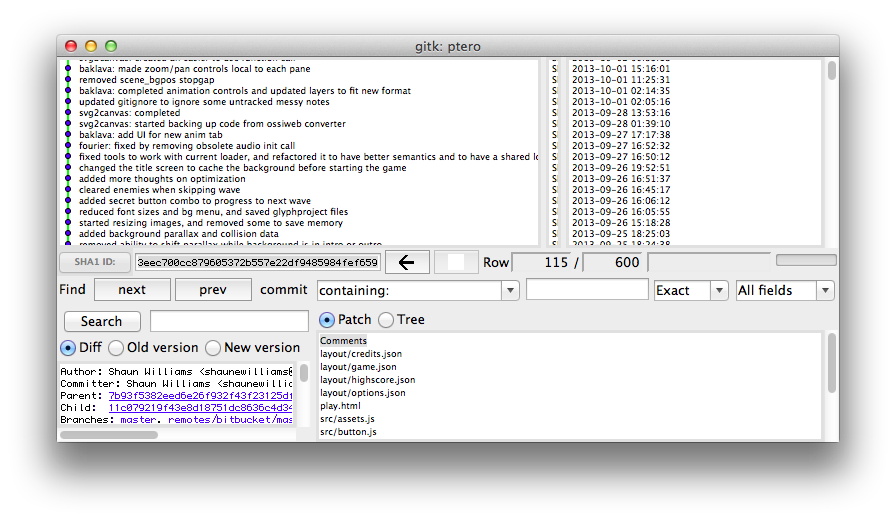
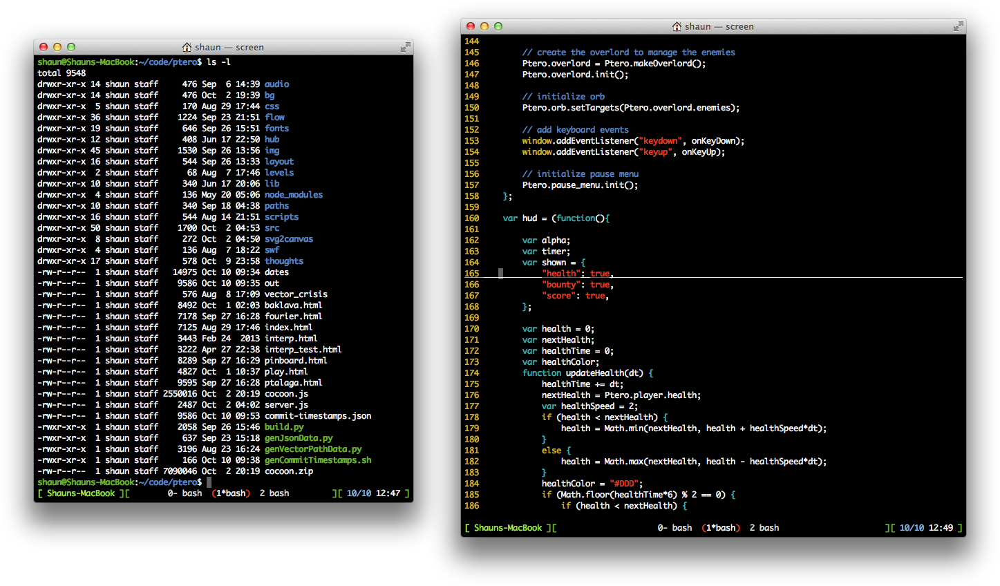
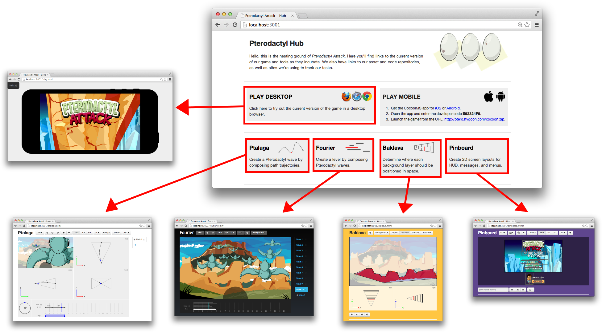
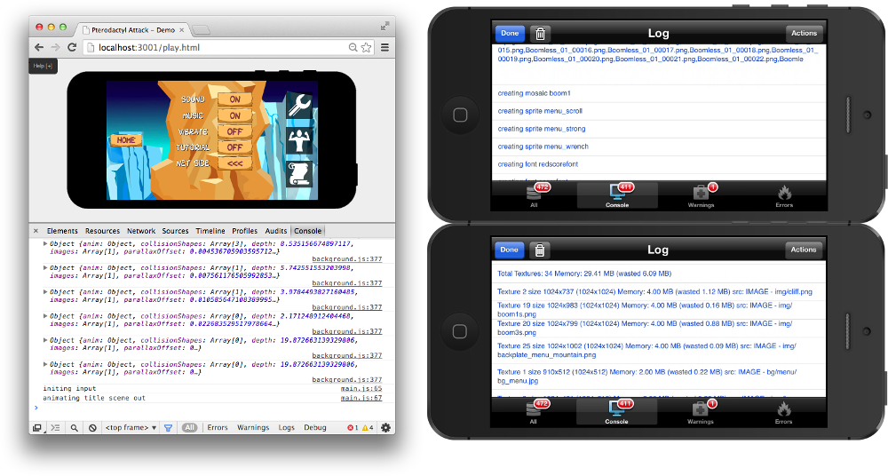
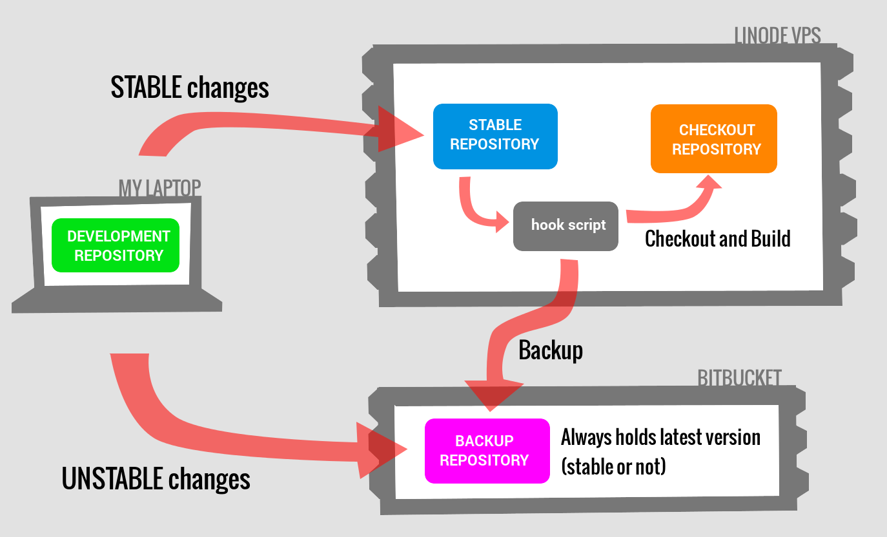
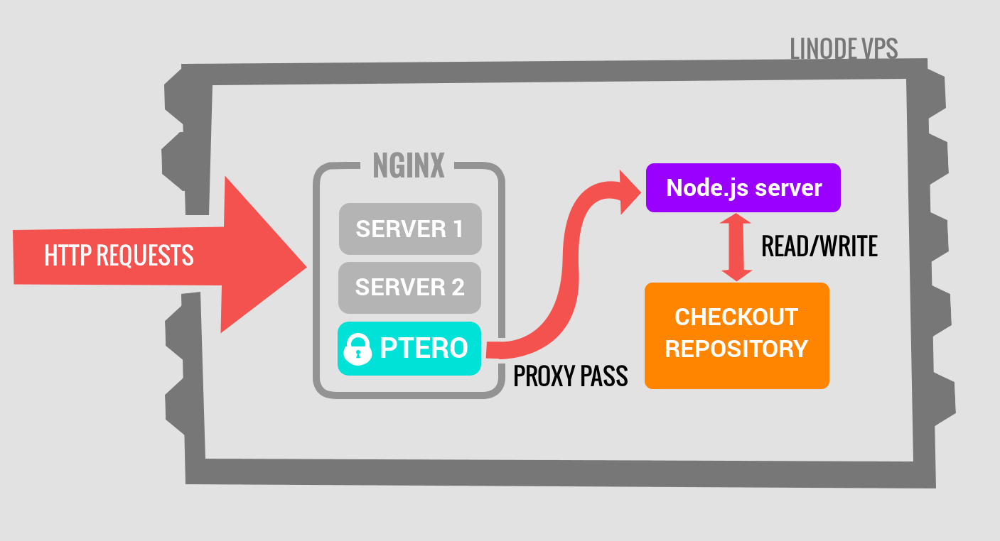

# DevOps - backbone of development

__TL;DR__ The game & tools run on a central password-protected website for all
team members to be in sync.  Our phones/tablets pull the latest version each
time we test the game.

----

This section is an overview of our Developer Operations (DevOps).  I've
struggled to define exactly what that means for us, but I consider it to be the
technology that _supported_ the process of our development.  It's the backbone
of our workflow that evolved over time.  So, I'll cover the processes in which
we develop, test, share, backup the game, and other things.

## Team Workflow

I am the sole programmer on the team.  Art assets are handed to me to integrate
into the game.  The game and content tools are accessible from any web browser for
the team members to use, via a private web server.  For the most part, the
content generated by the tools are handed back to me to integrate into the
game.  Stable versions of the game are frequently pushed out to our private web
server so the team can test the game.

Here is diagram to simplify the general workflow:

Everything after this point will be pretty technical, so read on if you're
interested in details.

### Tracking Project History

The game workspace consists of code, data, images, and notes.  I want to track the
history of all the changes in this workspace, and I want it backed up in
different places so that I won't lose all the work I've done.

To this end, I track all the work in a [git](http://git-scm.com/) repository.
It contains the entire history of the project so that I may revisit any past
version for any reason (e.g. undoing changes, searching for bugs).  It also
allows me to sync it to other locations for distributing and redundant backups.

This is a preview of the `gitk` tool, which is a visual tool for navigating and
performing operations on the history of your data. I never use it but it makes
a better visual than a terminal screenshot!

### Programming Environment

There's nothing too fancy about my programming environment.  It is a directory
of files that I navigate in a Terminal and edit with a text editor,
Vim.

The game and the tools are HTML files that include their respective Javascript
files from the source directory.  I can just open "play.html" in a web browser
and it would run fine.  But the tools need to be able to write back to the workspace.  So
I run a custom Node application at the root directory with `node server.js`,
and navigate my browser to http://localhost:3001.  This pops up:

(The tools shown above will be covered in a later chapter)

The main page serves as a hub for me and the team, to provide links to the
game, tools, and other team-related items elsewhere on the web.

To test the game on my phone, I run a `build.py` script which auto-generates a
couple files, then creates the cocoon.zip file containing all the files needed
to run the game on mobile.  Since the webserver is running from this directory,
I just point the CocoonJS Launcher on my phone to the URL:
http://localhost:3001/cocoon.zip.

#### Debugging

Debugging can be done through the browser's Javascript Console or CocoonJS
Launcher's own console.  The browser console has the advantage of being able to
place breakpoints and step through the code to study the state of the game.
CocoonJS does not allow this.  But both consoles print useful stack traces for
reviewing the state of the function call stack when a crash occurs.  Both also
allow the use of `console.log`, `console.warn`, and `console.error` functions
for creating custom filterable messages for diagnosing problems.

CocoonJS Launcher has a Memory Log for viewing memory usage of textures.  I
emailed the Ludei support team asking for a similar log for Vector Path images,
which we use heavily. They agreed it would be useful, so it might come.

CocoonJS Launcher also allows you to [profile your
game](http://wiki.ludei.com/cocoonjs:launcherprofile), showing you the time
that is spent in each function.  This helped identify slow parts.  For example,
it confirmed what all game developers learn about truetype fonts;  they are too
slow!

### Building a server for sharing and backup

As I stated earlier, the whole team accesses the game and tools using a private
URL.  This allows them to run it on their phone or brower on their PC.  This
section covers the details behind the server that supports this.

#### Git setup

If I have an unstable version of the game/tools that I want to backup, I push
my changes to a private [bitbucket](https://bitbucket.org) repository.

But when I'm ready to publish a stable version of the game/tools to the team, I
push my changes to a private server ([a Linode VPS](https://www.linode.com/)).

These changes go straight to a [bare](http://git-scm.com/book/ch4-2.html)
repository that I call my __stable__ repo.  When the changes are received here,
it automatically executes a custom script called the [post-receive
hook](http://git-scm.com/book/en/Customizing-Git-Git-Hooks) to relay the
changes to a secondary local repository (non-bare) that I refer to as my
__checkout__ repo. This is where the game/tools content is actually made
available for viewing.

Though it may be confusing that I am copying the changes to two separate places
on the server, it seems to be common practice to keep a central bare repository
that isn't complicated by a checked out working directory.

The aforementioned post-receive hook also relays the received changes to the
backup repo on bitbucket.  If you remember what I said earlier, I only push
_unstable_ changes to bitbucket directly from my machine.  But _stable_ changes
I push to the server since I want them visible to the team.  Since I want all
latest changes on bitbucket, I just make the server relay all stable changes to
it automatically.

#### Webserver setup

On the webserver, I use the [forever](https://npmjs.org/package/forever) tool
to run the Node server app I mentioned previously.  I do this so that the
app restarts if my VPS itself restarts.

On top of that, I run an [nginx](http://wiki.nginx.org/) webserver on the VPS
to appropriately direct traffic to the Node server using [proxy
pass](http://wiki.nginx.org/HttpProxyModule). I further configure it with
[password protection](http://wiki.nginx.org/HttpAuthBasicModule) so that only
team members may access it.

