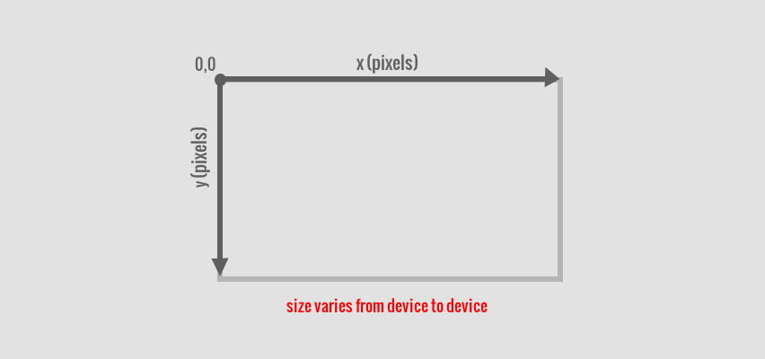
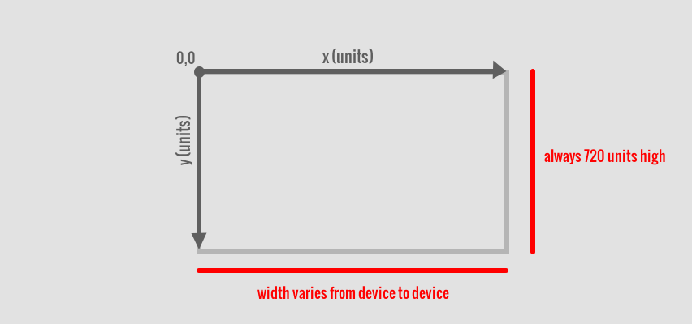
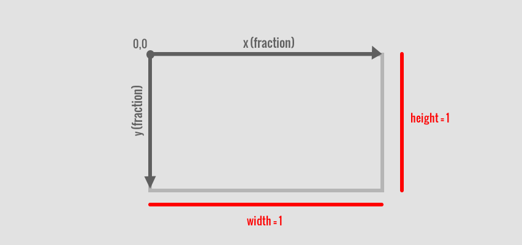
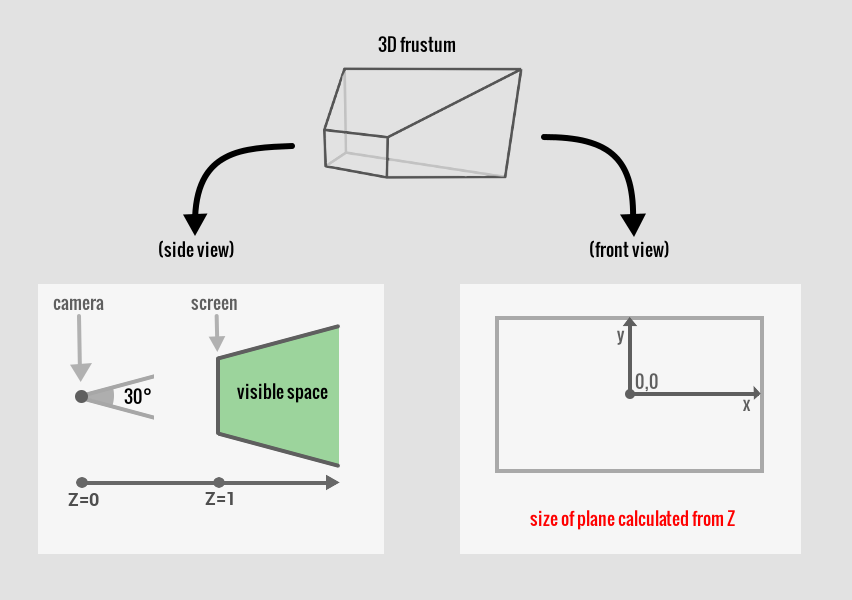

# Drawing to the Screen

This game engine supports placing 2D images in 3D space.  In order to do this,
we must establish some coordinate frames and some methods for drawing to them.

## Coordinate Frames

There are four separate coordinate frames that we use for different purposes.
Each was created to make drawing conceptually easier in a specific context.

### Canvas Coordinates

The game is drawn to a canvas.  On mobile devices, the canvas size is simply
matched to the screen's size.  Thus, the canvas size will vary from device to
device.

### Normalized Canvas Coordinates

In order to simplify the drawing on different size screens, we use normalized
canvas coordinates instead of the canvas coordinates based on pixels.  The
height of this normalized canvas is always locked at 720, but its width varies
with the aspect ratios for different devices.

### Layout Coordinates

When placing images on the screen for the HUD or menus, we use layout coordinates.
The width and height are set to 1.  This creates a percentage placement of items
for layouts that adapt to different aspect ratio screens.

### 3D Space Coordinates

When dealing with 3D space, we use normalized frustum coordinates, with the
near plane at z=1.  The vertical field of view (FoV) is always 30º, but the
horizontal FoV will vary from device to device depending on its aspect ratio.

## Drawing

### Billboards

### Sprites

### Text

### HUD-placement

### Screen-shaking
