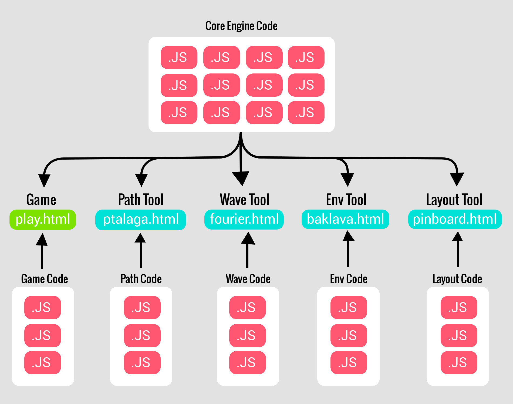
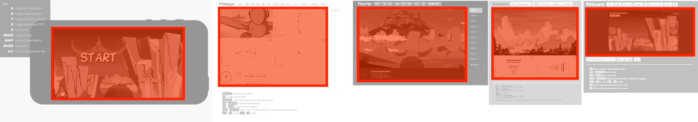

# File Overview

There are two types of files that the game and the tools are comprised of.
These are the __Javascript__ (.js) files that contain the logic that drives
execution, and the __HTML__ (.html) files that define and format the visual
elements around the page.

## Javascript Files

The source code, written in Javascript, drives the execution of the game and
tools.  As shown in the figure above, the core engine code is shared by all
programs, whereas the rest of the code is specific to each program.

### Minor details

The scope of all the code is kept inside a `Ptero` namespace.  The code is
sectioned into different files, with lowercase names, in the "src/" directory.

For the most part, the file names reflect the name of the main object it
contains.  Other times, the file name represents a logical grouping of related
objects.

## HTML Files

The game and tools are launched through a web browser by opening their
respective HTML file.

* play.html : plays the game
* ptalaga.html : tool for creating pterodactyl paths
* fourier.html : tool for orchestrating pterodactyl paths (waves)
* baklava.html : tool for customizing environment backrounds
* pinboard.html : tool for creating HUD and menu layouts

Each HTML file references all the core engine code as well as the specific code
to its program.  Each HTML file also includes code for defining and formatting
the visual interface elements of the page.

### The Canvas

A "canvas" is included in each of the game and tool pages.  The whole game
display and parts of the tool interface are drawn inside this canvas.

Below, the canvas is highlighted in red on each of the game and tool pages.
All of the interface items outside of the canvas are separate HTML elements.

## CocoonJS files

The game (but not tools) can be launched as a mobile game through the CocoonJS
Launcher or Cloud Compiler.  This is done by giving them a zip file that contains
all the resources required to run the game (e.g. images, sounds) and a single
javascript file containing all the game code.

The single Javascript is named "cocoon.js" and is generated by concatenating
the same source files used by the game's HTML file (play.html), as shown in the
figure at the top of the page.
