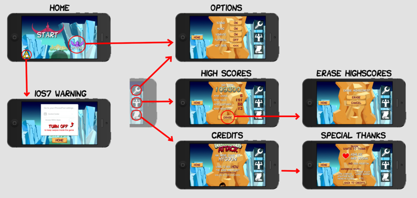
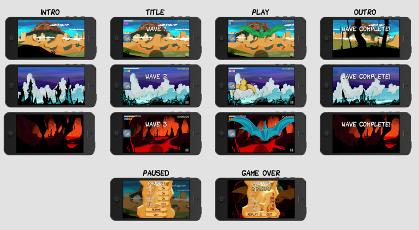
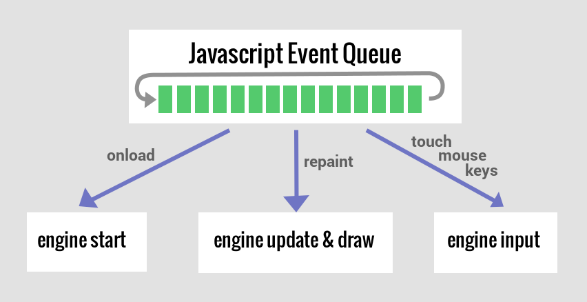
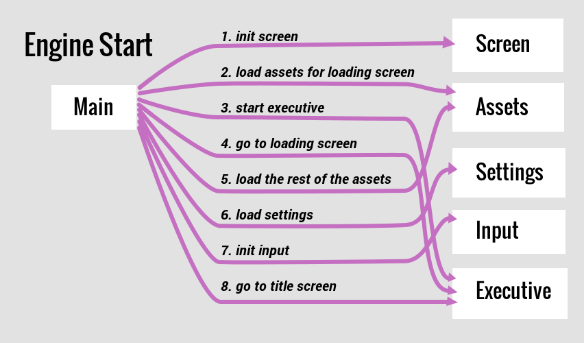
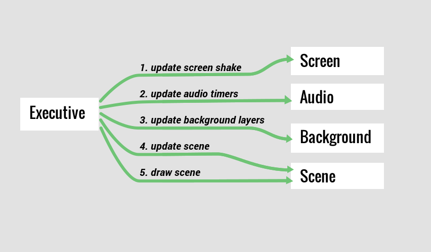

# Flow

This section covers the general flow of the game, both visual and
architectural.

## Visual Flow

The main menu has a simple flow to allow you to start the game, change options,
view high scores, view credits, and view an iOS suggestion on better
playability.

The first time you start the game, you will be taken to the tutorial session
that guides you through four lessons.  Each lesson will repeat until you pass.
Completion of the final lesson starts the game proper.

The game proceeds through several waves of pterodactyls.  Each wave begins with
the camera flying into a new environment, and ends with the camera flying out.
You can pause to adjust options or quit.  When the game ends, you are presented
a "game over" screen where you can see how you did and decide to replay or
quit.

## Architectural Flow

The game engine is written in Javascript, so its architecture must operate
around javascript's [event
queue](http://javascript.info/tutorial/events-and-timing-depth).  The game is
started by the onload event, updated and drawn by the repaint event (through
requestAnimationFrame), and accepts control through the input events.

The engine is _kickstarted_ by the "main" module, which loads all assets and
initializes the all of the other modules.

The _heartbeat_ of the engine is handled by the "executive" module.  This
ensures that the flow of the game passes through all of the appropriate modules
to make the game run.

### Scenes

For the most part, each of the screens in the "screen flow" section above
corresponds to their own "Scene".

A scene defines what the game engine is currently focused on (i.e. executing
and displaying).  When it's time to execute and display a new scene, its focus
must be redirected to said scene.

### Modules

Here is a description of the core modules shown in the figures above.

#### Main

There is a "main" module for the game and each tool that coordinates modules
for initialization:

- initializes the screen
- starts the loading screen
- starts loading all assets
- triggers initialization events and starts executive when assets are loaded

#### Screen

There is a screen module which controls:

- screen resolution
- camera offset and scale
- screen shaking
- 3D frustum
- conversion between our space and screen coordinates

#### Assets

There is an assets module which contains:

- list of asset file paths and types
- logic for building game structures from assets
- logic for loading all assets at once

#### Executive

There is an executive module that controls:

- the main loop
- variable update rate
- display of the computed framerate
- execution speed for slowmo and pausing

#### Scenes

A scene is any object that can be plugged into the main loop as a unit of
execution.  It has the following functions:

- init (called when we switch to this scene)
- update (called every frame with the time elapsed since last frame)
- draw (called every frame with canvas context)
- cleanup (called when we switch to another scene)

#### Input

There is an input module which provides:

- touch/mouse events in screen or space coordinates

#### Settings

There is a settings module that provides:

- access to all scores/settings variables
- persistence of all scores/settings variables
