# Gameplay Design

What follows is an explanation of how we tried to build a fun game around a
simple firing mechanic.

## Starting with simple shooting

The game started with just a single mechanic of firing bullets.  The accuracy
and speed of your bullets was the only determing factor for how well you were
doing in the game.  Frankly, this mechanic didn't have any excitement.  It was
interesting in and of itself, but it made for very stale gameplay.

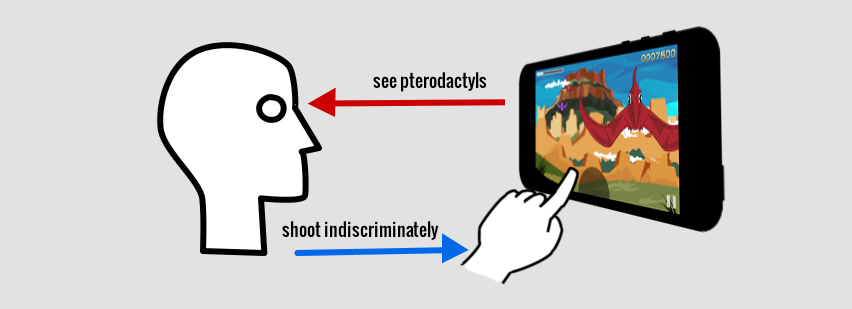

## What was missing

I realized that in this simple game, if the player dies, it was only because
they weren't shooting fast enough.  I don't think that's a compelling enough
reason to continue playing.

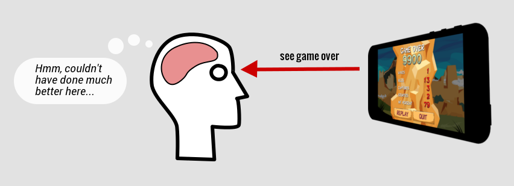

I postulated that at the end of a game, the player has to feel a sense that
they could've done something better.  Instead of mindlessly shooting as fast as
they could, there had to be some kind of decision to make-- something to make
them think and reason about what they were doing.  In other words, there has to
be an element of strategy that the player will want to improve in their
play-throughs.

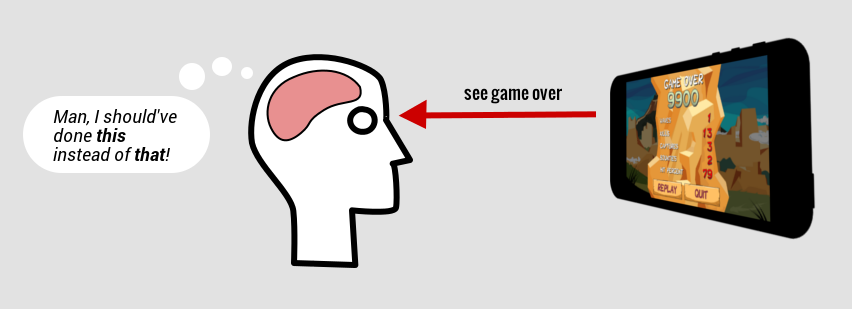

## The capture mechanic

The capture mechanic was introduced to create these aforementioned "decision
moments" in the game.  The player is presented with different colored eggs
as part of a bounty for earning health.  You capture the correct colors
to earn a point of health to help you survive more waves.

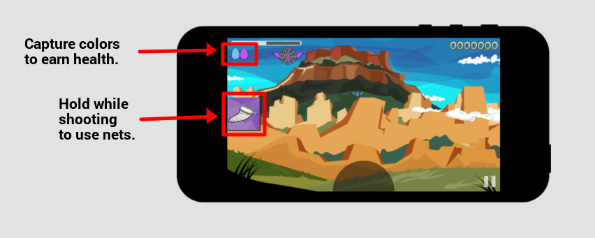

Capturing takes only one shot, so it's easier than shooting an enemy down.  But
if you capture an incorrect color, the "cage" of pterodactyls captured for the
current bounty is emptied, creating a potentially difficult situation to
recover from.

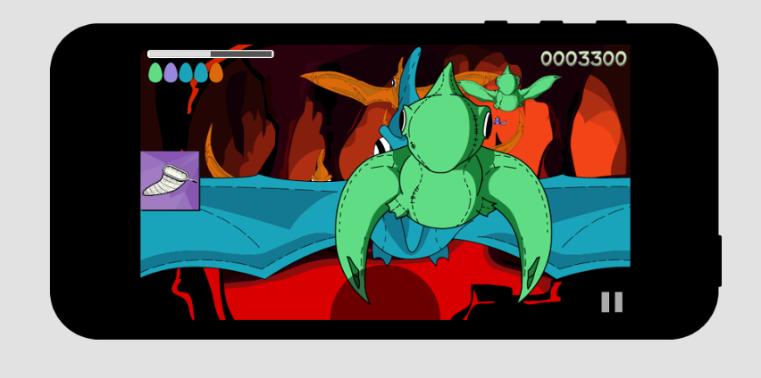

The context switching between strategic capturing and frantic shooting created
a much more interesting experience that encourages the player to choose when to
be calm and when to be frantic.  It's a decision strategy that enriched an
otherwise dull experience.

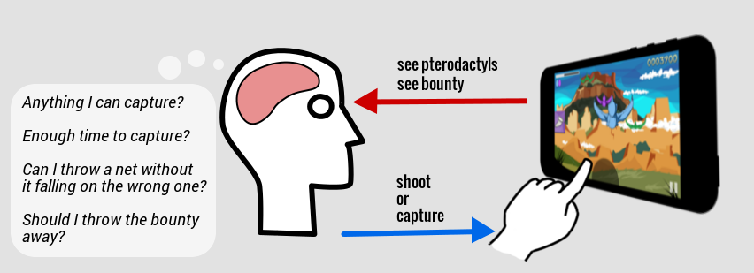

Interestingly, you can purposefully capture the wrong color to flush the
bounty. One may be compelled to do this in order to get a wider variety of
colors in the bounty to allow for a quicker health boost.  The price for doing
this is only measured in the risk of dumping any of the captured pterodactyls
on the screen.

## Points

I wanted to keep the points as a simple representation of the player's overall
performance. To this end, there is no inflation due to streak bonuses or
multiplier rewards. I didn't want point growth to become a primary driver in
the game; I wanted point growth to simply represent the actions of the game.

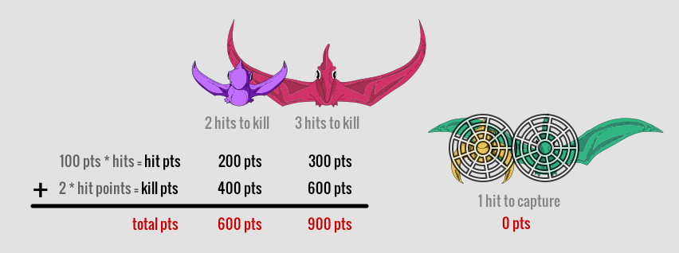

The flaplings take two hits to kill, and the adults take three hits to kill.
You get 100 points for every hit.  You get twice the total hit points that you
earned for that enemy once you kill them.  Flaplings and adults take one hit
from a net to capture.  No points are earned from capturing.  This is to focus
the incentive on earning health rather than points, and to remove any point
incentive to juggle pterodactyls with the nets.

It is perhaps interesting to note that you can shoot the pterodactyls before
capturing them to get points. This point conversion measures the risk taken
from extra time spent on capturing.

## Spawning Pterodactyls

Each environment has a set of four preset pterodactyl colors (shown below).
Two colors are associated with flaplings, and two colors are associated with
adults:

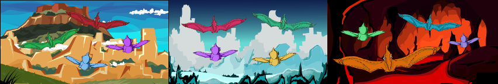

Each environment also has a set of ten preset pterodactyl paths (shown below).  

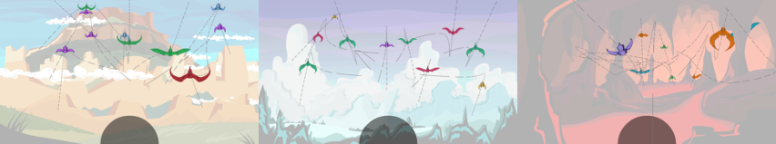

When it is time for a pterodactyl to show up on screen, it is given a random
path from the set of ten presets, and it is given a random color from the set
of four colors.

## Attack Patterns

The game is split into waves of pterodactyls.  Each wave consists of five
groups (colored below).  You can see a timeline of the first 15 waves below.  A
dot corresponds to a pterodactyl being released.

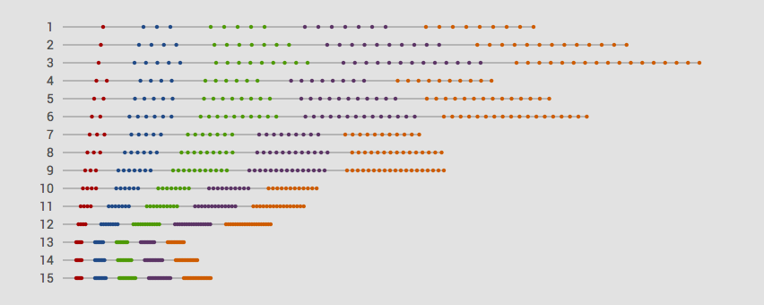

The time between each pterodactyl and group decreases over time.  Each group in
a wave is a constant number of pterodactyls more than the previous group.  This
"group growth" cycles between 2,3,4 for successive waves.  The size of the
first group for each wave grows by one every three waves.

## Adjusting the difficulty

Designing a good difficulty curve is rather difficult.  The problem of
balancing accessibility and pacing is probably best addressed by creating
separate difficulty levels.  This may be something I continue experimenting
with, but I settled on having an initially difficult game to sacrifice some
accessibility for better pacing.

## Changes in scenery

The game changes scenery after every wave.  The effect serves the pacing of the
game well in the beginning, creating a reminder of progress early on and a
chance to breath while enjoying the scenic animations.

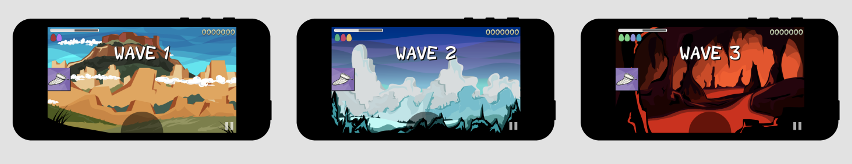
