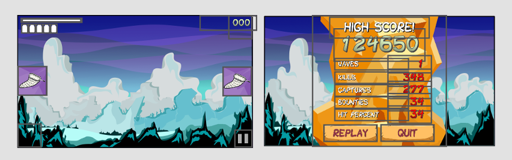
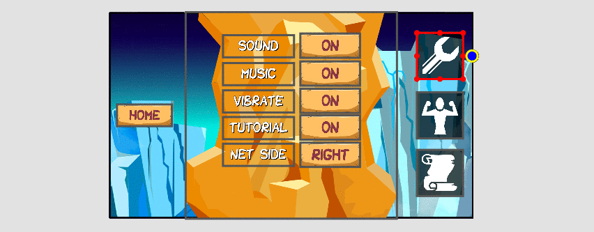
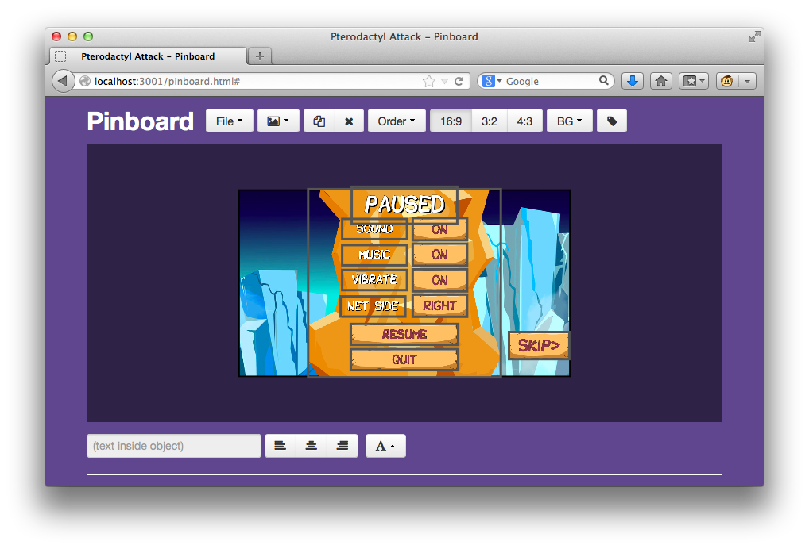

# Menu and HUD Layouts

The previous sections have covered how we position and draw different types of
textures on the screen.  We build the menus and HUD layouts using these techniques
discussed with a specific tool for the job.

## Adapting to screen sizes

For our layouts to adapt to different screen sizes, we use a property of our
"billboards" that we discussed in the [drawing section](drawing.md).  Each
billboard has an anchor that we compute using "layout coordinates".  These
layout coordinates are defined as a percentage of the full width or height of
the screen.

Using this, some elements will hug a specific side of the screen for an
adaptable layout.  See some examples below:

## The Pinboard Tool

The tool that we use to build these layouts is essentially a virtual pinboard.
The selected element is shown with a red border, and its "pin" is shown in
blue.  The pins always stay in the same relative screen position (a percentage
of the full width or height).

### Tagging Elements for Dynamic Behavior

With this tool, we can also tag elements with names. We do this for elements
that we wish to access with code, such as a buttons for attaching actions or
text elements to update in-game.

### Output Format

As with the other tools, our layouts are exported from Pinboard in a JSON format.
This file is then loaded into our engine.

### Video Demo

You can watch the [Pinboard demo video](http://www.youtube.com/watch?v=b3_EXQTKDc4)
to see how we build the Options menu.
