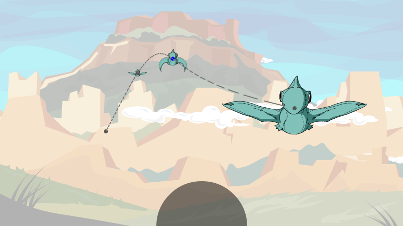
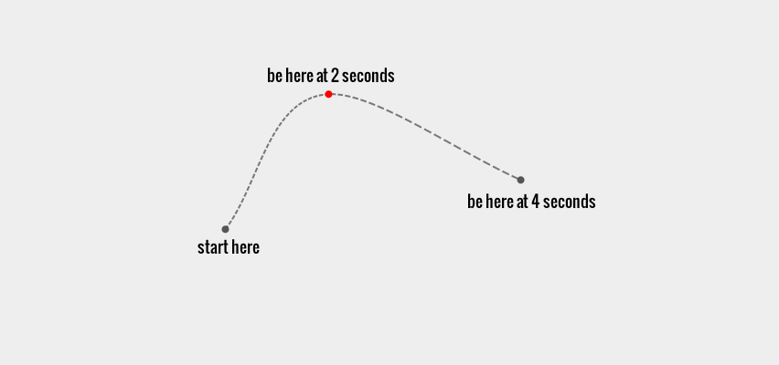
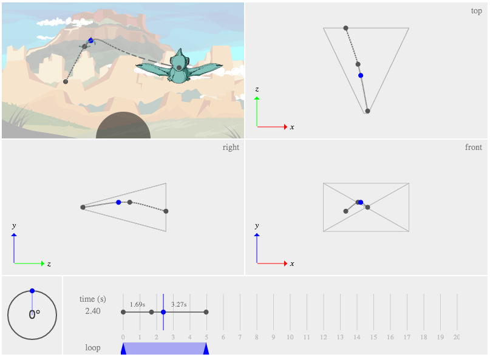

# Pterodactyl Paths

In this game, pterodactyls fly toward you along predefined paths.  Here, we
will discuss the nature of these paths and the tool we built for constructing
them.

## A Smooth Path

To create a simple path for the pterodactyls, we used something called [Cubic
Hermite splines](http://en.wikipedia.org/wiki/Cubic_Hermite_spline).  It
generates a complete smooth path from a set of timed waypoints.

The curvature of the path is dependent on the timing at each waypoint.

This was a sufficient solution for us, and it helped simplify the tool
requirements for creating smooth paths.

## The Tool

To create, save, preview, and share the paths for the pterodactyls, we created
a tool called Ptalaga, a name chosen as a play on the game Galaga, which we
admired for having beautiful enemy paths.

### Views

The tool provides different perspectives to allow the user to easily move the
waypoints to any position in space.  It also allows the user to set the time
for each waypoint at the bottom section of the window.  At the bottom left, you
can see the control for changing the rotating of the pterodactyl at each
waypoint.

### Demo

To learn more about how the tool is used, view this short demo video here:
<http://youtu.be/2Tc6txawD4U>

### Saving Paths

The tool saves the path as a JSON file, which just holds information about each
waypoint.  I place the JSON file in one of our game sub-directories and tell
the engine to load that path into a library for a particular level at runtime.

### Level Patterns

The gameplay logic throws a random pterodactyl at you at decreasing intervals
over time.  Each level has a group of pterodactyl paths that are chosen at
random.  Then it launches some random type of pterodactyl along that path.

