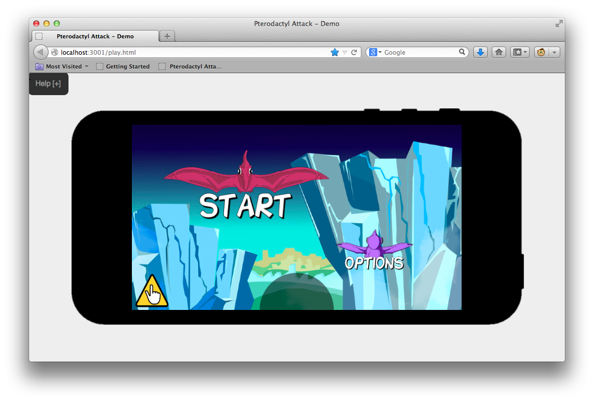

# Quick Look

The game is built on HTML5 Canvas and Javascript, meaning we can simply play it
in a web browser.

But the game is really intended as a mobile game for phones and tablets.  So we
primarily run it with the [CocoonJS Launcher for
iOS/Android](http://wiki.ludei.com/cocoonjs:launcherapp).  This is done by
giving the launcher a zip file containing all the webpage files for our game.

When we're ready to release the game, CocoonJS will take our zip file and turn
it into a native app that we can put on App Store or Google Play.

Some of the tools we use for developing the game are also built on HTML5 Canvas
and Javascript, which will be covered in a later chapter.

