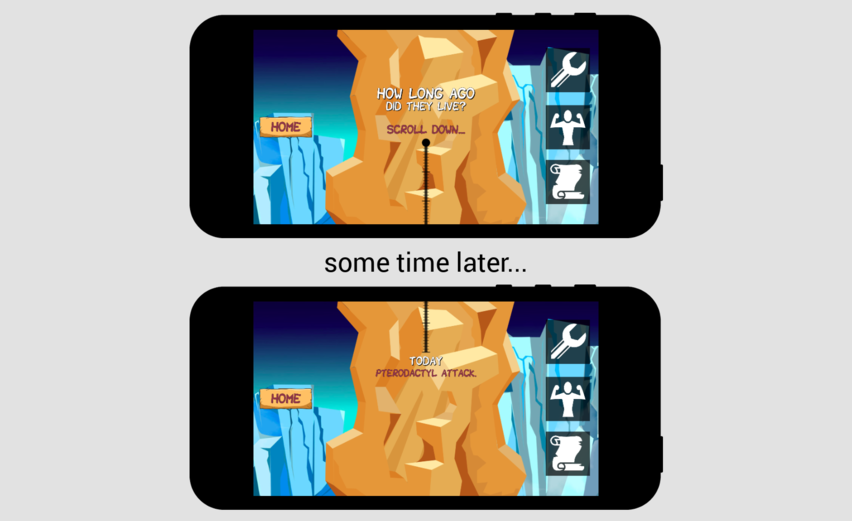

# The Surprise

After the engine, tools, and game were designed and built, I started looking at
the game holistically.  I wanted to make sure the game had some element of
surprise, a touch of love to add some personality to the game.

To this end, I placed three extra things at the end of the credits, to be found
by the curious player.

## The Fossil

As a joke about the amount of time spent and the sheer difficulty of finishing
the game, I placed a picture of a pterodactyl fossil expressing its disbelief
about our accomplishment.

## The Facts

Since the game is about pterodactyls, I thought it would be a good thing to
teach the players some accessible and interesting facts about them.

## The Timeline

Perhaps the most interesting fact presented is the one about time.  220 million
years is an unfathomable length of time.  I wanted to display some kind of
timeline to illustrate this to the player.

But I realized how unfathomable it was when I tried making a horizontal
timeline, shown below.  It was way too small; the entirety of human
civilization wouldn't even cover the width of a single pixel.  The illustration
wouldn't work at that scale.

So I decided to make the timeline vertical.  Starting from 220 million years
ago, I displayed the entire timeline at a dizzying scale allowed by the medium
of a scrollable screen.  It became a mini-game to reach the bottom.

Once you reach the bottom, the player will have a better understanding about
how long ago pterodactyls had lived.  There is a secret at the bottom as an
award for people who ventured that far.

