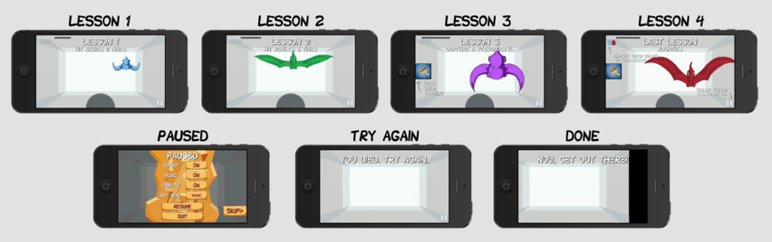
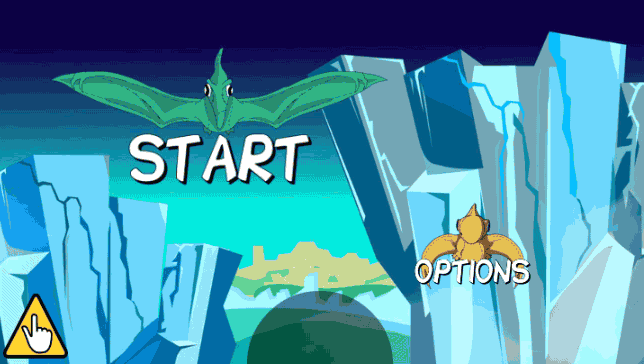
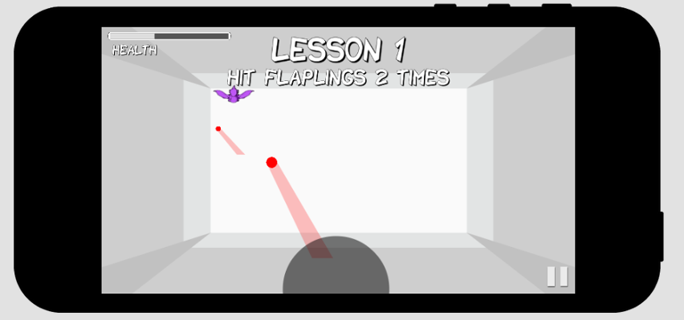
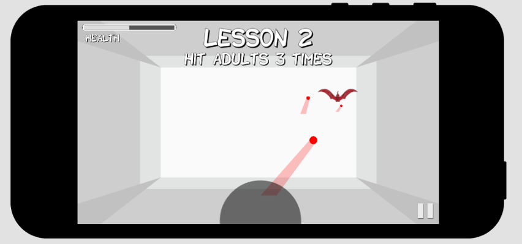
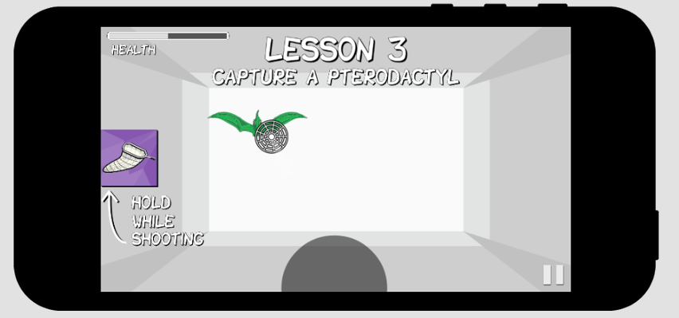
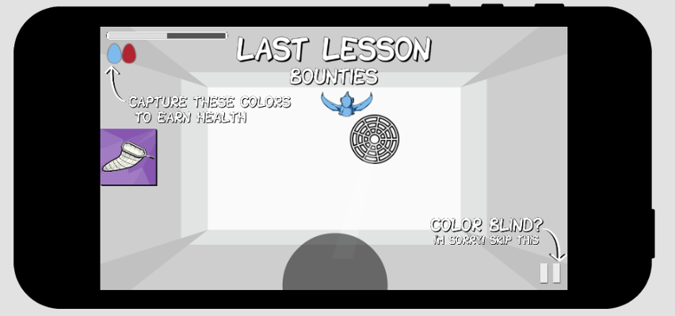

# Tutorial Design

This section covers how we teach the player how to play the game.

## The main menu

The player actually cannot leave the Main Menu without learning how to shoot
pterodactyls.  So it serves as a mini-introduction to the mechanic.  Tapping on
either of the pterodactyls shows a short instruction animation shown below:

## Deciding on a Tutorial Level

Though there are [great examples](http://www.youtube.com/watch?v=8FpigqfcvlM)
of how to teach the player with clever level design, we decided to create a
separate tutorial level, a sort of isolated environment for spelling out
exactly how the mechanics work.

## Focusing

The tutorial is composed of four small tests. Each will repeat with an
audiovisual notification on what went wrong if the player failed.  The arena is
designed to be colorless and minimal so that all attention is focused on the
pterodactyls flying at you.

## Health and Death

To teach the player about health, they can get hit. If they get hit enough
times they will die and be presented with a message "You died.  Try again."
They will restart the current lesson.

## Lessons

The player is taught in Lesson 1 that flaplings need to be hit with two
bullets.

The player is taught in Lesson 2 that the adults are stronger and need to be
hit with three bullets.

The player is taught in Lesson 3 that they can capture pterodactyls by holding
the net button while shooting.  If they kill the pterodactyl, the message
blinks and a "wrong" sound plays and they are thrown another pterodactyl.

The player is taught in the final lesson that they can only capture certain
color pterodactyls.  The bounty shows the correct colored eggs.  If all colors
are captured, they earn health.  If the wrong color is captured, the cage is
dumped.

