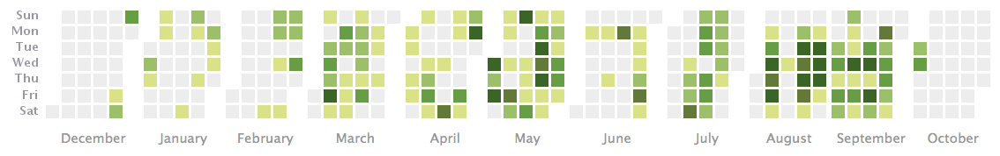
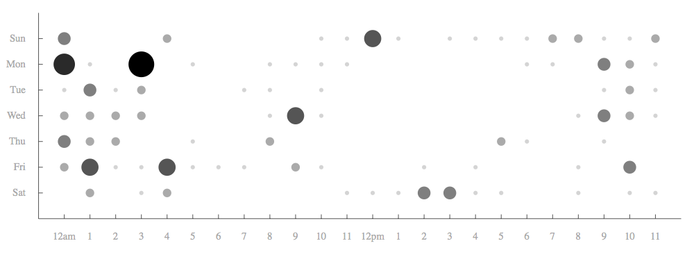

#### Visualizing my work habits

Another benefit of tracking development is that I can perform some analytics on
my project history to see my work behavior.

This is a visualization of the number of code commits I made each day:

This graph is really interesting to me, because I can see how gung-ho I
was in May after quitting my job to work full-time on the game.  You can
see that I hardly took any breaks until I burned out pretty hard in June.

It's also very interesting to look at the days of the week and hours of the day
that the commits were made.  Below you can see what eventually led to me
quitting my job.  I was working on the game in the mornings before commuting to
my job, and after work in the evenings and really late at night.  I'll
write more about this erratic work schedule in a later chapter.

This is before I quit my job:

This is after I quit my job:

You can see how these graphs were created in [this workspace](work/git-visuals).

